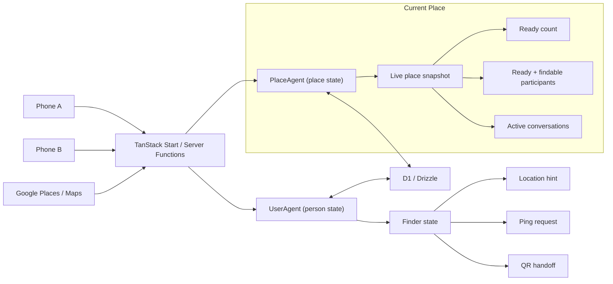
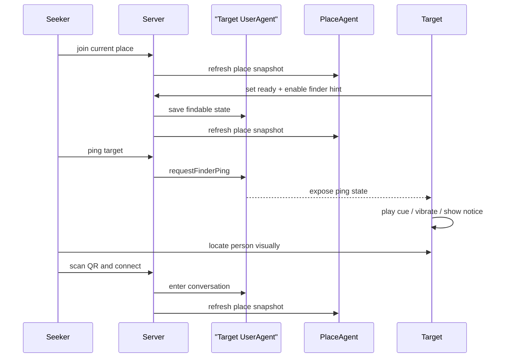

# Ready to Talk

Ready to Talk is a phone-first web app for starting in-person conversations when
two people are already in the same place and ready right now.

The current app is built with:

- TanStack Start
- React + TypeScript
- Tailwind CSS
- Better Auth
- Drizzle ORM + Cloudflare D1
- Cloudflare Agents for live user/place state
- Google Places + Google Maps

## Current MVP

The repo currently supports:

- email/password sign-in with pseudonymous usernames
- onboarding with mood emoji and short intent
- nearby place discovery from the current location
- live place presence with `present`, `ready`, and `in_conversation` states
- personal QR handoff for starting a conversation
- finder MVP: a ready person can share a simple in-place location hint
- finder ping: someone nearby can send a quick cue before scanning the QR

The finder flow is intentionally coarse. It helps people locate each other
inside a venue without pretending the browser can do exact indoor direction
finding.

## Core Flow

1. Sign in.
2. Grant location access.
3. Pick the current nearby place.
4. Save mood + intent.
5. Set yourself `ready`.
6. Optionally turn on `Help someone find me` and choose a location hint.
7. Someone nearby can use the place view to find you, optionally send a ping,
   and then scan your QR to connect.

## Architecture

Two agent types coordinate the live state:

- `UserAgent`
  - owns user profile/status state
  - tracks place membership
  - handles finder hint and ping state
  - manages conversation entry/exit transitions
- `PlaceAgent`
  - exposes the live place snapshot
  - keeps ready counts and participant lists current
  - broadcasts updates to connected place views



## Finder + QR Sequence



## Local Development

1. Install dependencies:

```bash
pnpm install
```

2. Create a local secrets file:

```bash
cp .dev.vars.example .dev.vars
```

Set these values in `.dev.vars`:

- `BETTER_AUTH_SECRET`
- `BETTER_AUTH_URL`
- `GOOGLE_MAPS_API_KEY`
- `GOOGLE_MAPS_MAP_ID` (recommended for Advanced Markers)

The Google key powers both server-side nearby place search and the browser map.
Enable both the `Places API` and the `Maps JavaScript API`, then lock the key
down with HTTP referrer restrictions for your app domains.

If `GOOGLE_MAPS_MAP_ID` is set, the nearby map uses `AdvancedMarkerElement`.
Without it, the app falls back to classic markers.

3. Apply local D1 migrations:

```bash
pnpm run db:migrate:local
```

4. Start the app:

```bash
pnpm run dev
```

The auth API is mounted at `/api/auth/*`.

## Database Workflow

Generate a new Drizzle migration:

```bash
pnpm run db:generate
```

Apply migrations locally:

```bash
pnpm run db:migrate:local
```

Apply migrations remotely:

```bash
pnpm run db:migrate:remote
```

## Cloudflare Setup

`wrangler.jsonc` already includes:

- D1 binding: `DB`
- durable objects: `PlaceAgent`, `UserAgent`
- local migration directory: `./drizzle`

Before deploying, create a real D1 database and either update
[`wrangler.jsonc`](/Users/craig/Code/wdc/readytotalk/wrangler.jsonc) or target
the database via Wrangler configuration.

Set the required secrets:

```bash
wrangler secret put BETTER_AUTH_SECRET
wrangler secret put GOOGLE_MAPS_API_KEY
wrangler secret put GOOGLE_MAPS_MAP_ID
```

## Verification

Typecheck:

```bash
pnpm run typecheck
```

Tests:

```bash
pnpm run test
```

Production build:

```bash
pnpm run build
```
